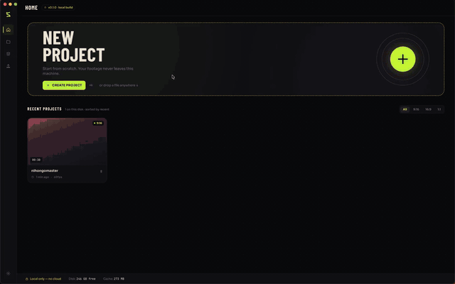
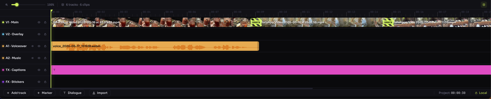
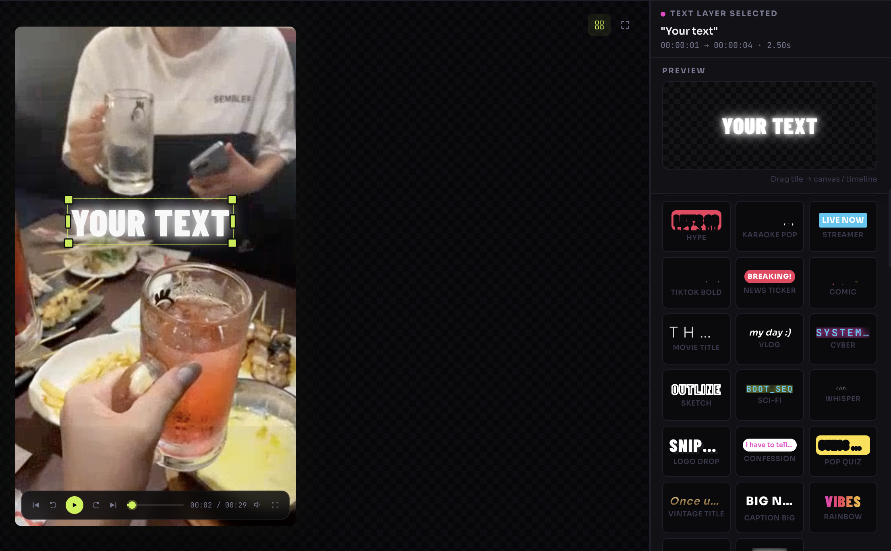
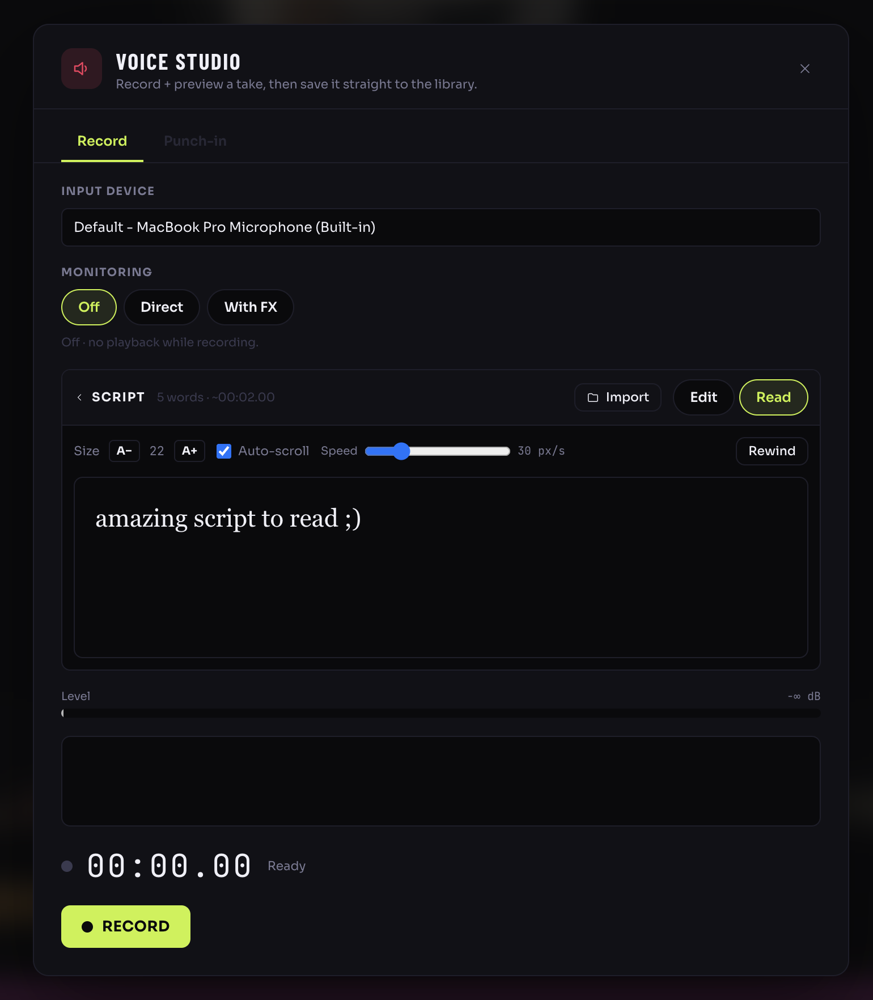
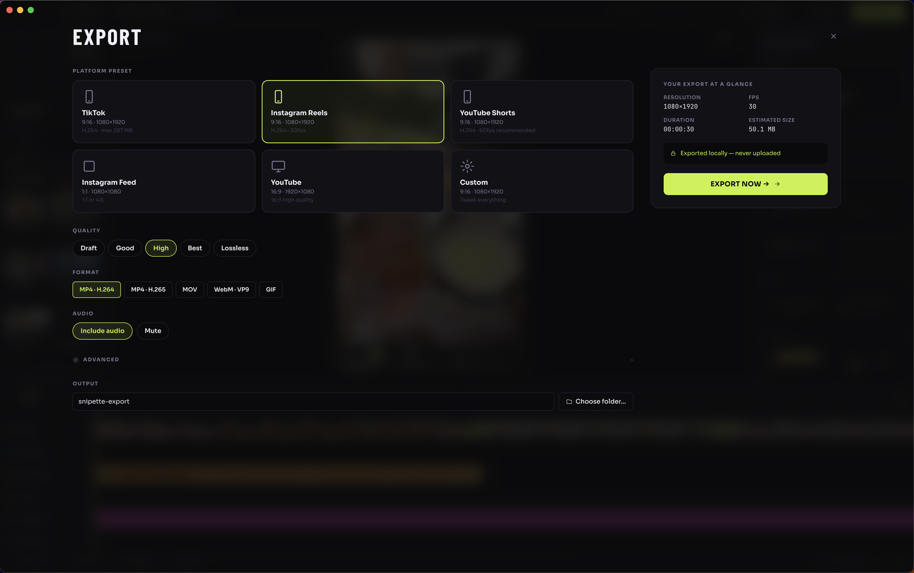
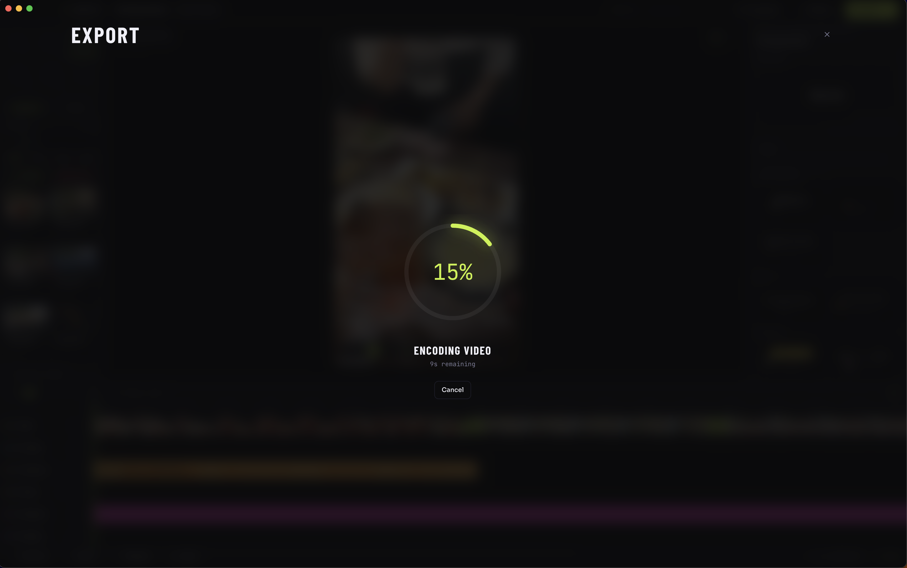

# Snipette

> **Cut local. Stay private. Go viral.**
>
> A local-first, offline video editor for creators making short-form content. Every byte stays on your machine.

[](https://www.electronjs.org/)
[](https://react.dev/)
[](https://www.typescriptlang.org/)
[](https://vitejs.dev/)
[](#license)

Snipette is a desktop video editor aimed at TikTok, Reels, and Shorts creators who would rather not hand their footage to someone else's cloud. It runs entirely on your machine: no accounts, no telemetry, no upload step. Think of it as a CapCut alternative that respects your hard drive and your privacy.

<p align="center">
  <a href="docs/media/intro.mp4">
    
  </a>
</p>

<!--
  GitHub renders the <video> tag below natively. The GIF above is a fallback
  for npm, mirrors, and other markdown renderers that ignore raw HTML video.
-->
<p align="center">
  <video src="docs/media/intro.mp4" autoplay loop muted playsinline width="820"></video>
</p>

---

## Table of Contents

- [Screenshots](#screenshots)
- [Features](#features)
- [Tech Stack](#tech-stack)
- [Requirements](#requirements)
- [Quick Start](#quick-start)
- [Project Structure](#project-structure)
- [Scripts](#scripts)
- [Whisper Setup (Local Captions)](#whisper-setup-local-captions)
- [Architecture](#architecture)
- [Build & Package](#build--package)
- [Privacy](#privacy)
- [License](#license)

---

## Screenshots

<table>
  <tr>
    <td width="50%">
      
      <p align="center"><sub><b>Canvas.</b> Preview, timeline, and inspector in one window.</sub></p>
    </td>
    <td width="50%">
      
      <p align="center"><sub><b>Timeline.</b> Multi-track, razor, slip, snap, per-edge resize.</sub></p>
    </td>
  </tr>
  <tr>
    <td width="50%">
      
      <p align="center"><sub><b>Text animations.</b> 28+ named templates including block-reveal and kinetic typography.</sub></p>
    </td>
    <td width="50%">
      
      <p align="center"><sub><b>Voice studio.</b> Record voiceovers on-device, no upload step.</sub></p>
    </td>
  </tr>
  <tr>
    <td width="50%">
      
      <p align="center"><sub><b>Export.</b> WebCodecs pipeline with an ffmpeg fallback.</sub></p>
    </td>
    <td width="50%">
      
      <p align="center"><sub><b>Export in progress.</b> Live progress and frame stats while the encoder runs.</sub></p>
    </td>
  </tr>
</table>

---

## Features

- Multi-track timeline with razor, slip, snap, and per-edge resize
- Keyframeable transforms, opacity, color, and audio fx
- 28+ named text animation templates (block-reveal, kinetic typography, drop-in subtitle, etc.)
- Beat detection and audio ducking
- Voice recording and local TTS
- Thumbnail strip generation via ffmpeg
- WebCodecs based export pipeline plus an ffmpeg fallback
- Local speech-to-text with whisper.cpp (English models, word-level timestamps)
- Auto-backup with restore points stored next to your project

## Tech Stack

### Runtime

| Package | Version | Purpose |
| --- | --- | --- |
| [`electron`](https://www.electronjs.org/) | `^32.1.2` | Desktop shell |
| [`react`](https://react.dev/) | `^18.3.1` | Renderer UI |
| [`react-router-dom`](https://reactrouter.com/) | `^6.27.0` | Client-side routing |
| [`zustand`](https://github.com/pmndrs/zustand) | `^4.5.5` | Global state |
| [`framer-motion`](https://www.framer.com/motion/) | `^11.11.0` | Motion and gesture |
| [`@react-spring/web`](https://www.react-spring.dev/) | `^9.7.4` | Spring animation for text fx |
| [`better-sqlite3`](https://github.com/WiseLibs/better-sqlite3) | `^11.3.0` | Local project DB |
| [`electron-store`](https://github.com/sindresorhus/electron-store) | `^10.0.0` | User settings (JSON) |
| [`electron-log`](https://github.com/megahertz/electron-log) | `^5.2.0` | File and console logging |
| [`ffmpeg-static`](https://github.com/eugeneware/ffmpeg-static) | `^5.2.0` | Bundled ffmpeg binary |
| [`ffprobe-static`](https://github.com/joshwnj/node-ffprobe-static) | `^3.1.0` | Bundled ffprobe binary |
| [`mp4-muxer`](https://github.com/Vanilagy/mp4-muxer) | `^5.2.2` | WebCodecs MP4 muxing |
| [`date-fns`](https://date-fns.org/) | `^3.6.0` | Date utilities |
| [`uuid`](https://github.com/uuidjs/uuid) | `^10.0.0` | ID generation |

### Build & Tooling

| Package | Version | Purpose |
| --- | --- | --- |
| [`typescript`](https://www.typescriptlang.org/) | `^5.6.2` | Static typing |
| [`vite`](https://vitejs.dev/) | `^5.4.8` | Dev server and bundler |
| [`electron-vite`](https://electron-vite.org/) | `^2.3.0` | Electron-aware Vite preset |
| [`electron-builder`](https://www.electron.build/) | `^25.1.7` | Packaging and native rebuild |
| [`tailwindcss`](https://tailwindcss.com/) | `^3.4.13` | Styling |
| [`postcss`](https://postcss.org/) + [`autoprefixer`](https://github.com/postcss/autoprefixer) | `^8.4.47` / `^10.4.20` | CSS pipeline |
| [`prettier`](https://prettier.io/) | `^3.3.3` | Formatting |

### External Binaries (not on npm)

| Tool | Where it lives | Used by |
| --- | --- | --- |
| `ffmpeg` / `ffprobe` | Pulled in by `ffmpeg-static` and `ffprobe-static`, unpacked from asar at runtime | `electron/services/ffmpeg.service.ts`, `encoder.ts` |
| `whisper.cpp` CLI plus model | Manually placed in `resources/` | `electron/services/whisper.service.ts` |

---

## Requirements

- **Node** 18.18+ (Node 20 LTS recommended). Node 26 currently breaks the pinned `better-sqlite3@^11.3.0`, so stick to 20 unless you bump the dep.
- **npm** 9+ (or pnpm/yarn, scripts assume npm)
- **Python 3** on `PATH` for `node-gyp` to compile `better-sqlite3` against Electron headers
- **Xcode Command Line Tools** on macOS, **build-essential** on Linux, **windows-build-tools** or VS Build Tools on Windows
- Optional: a built `whisper.cpp` for local captions, see [Whisper Setup](#whisper-setup-local-captions)

## Quick Start

```bash
git clone https://github.com/your-org/snipette.git
cd snipette
npm install
npm run dev
```

The `postinstall` hook does two things:

1. Runs `ffmpeg-static`'s install script, which downloads the platform-specific ffmpeg binary into `node_modules/ffmpeg-static/`.
2. Runs `electron-builder install-app-deps`, which rebuilds `better-sqlite3` against Electron's ABI (your system Node ABI will not match).

If `npm install` fails compiling `better-sqlite3`:

```bash
npm install --ignore-scripts
npm run rebuild
```

## Project Structure

```
snipette/
├── electron/                  # Main process
│   ├── main.ts                # Entry: BrowserWindow, app lifecycle
│   ├── preload.ts             # contextBridge: typed IPC surface
│   ├── ipc/                   # One file per IPC channel group
│   │   ├── project.ipc.ts
│   │   ├── media.ipc.ts
│   │   ├── timeline.ipc.ts
│   │   ├── export.ipc.ts
│   │   ├── web-export.ipc.ts
│   │   ├── whisper.ipc.ts
│   │   ├── tts.ipc.ts
│   │   ├── voice-recording.ipc.ts
│   │   ├── backup.ipc.ts
│   │   ├── settings.ipc.ts
│   │   └── system.ipc.ts
│   └── services/              # Pure node-side logic
│       ├── db.service.ts          # better-sqlite3 wrapper
│       ├── ffmpeg.service.ts      # ffmpeg orchestration
│       ├── encoder.ts             # WebCodecs export pipeline
│       ├── whisper.service.ts     # whisper.cpp + WAV extraction
│       ├── tts.service.ts
│       ├── thumbnail.service.ts
│       ├── beat-detect.service.ts
│       ├── audio-graph.ts
│       ├── audio-ducking.ts
│       ├── audio-fx-filter.ts
│       ├── video-fx-filter.ts
│       ├── filter-graph.ts
│       ├── keyframe-filter.ts
│       └── backup.service.ts
│
├── src/                       # Renderer (React)
│   ├── main.tsx               # ReactDOM entry
│   ├── App.tsx                # Router root
│   ├── routes/                # Route components
│   ├── components/            # UI components (timeline, inspector, preview, ...)
│   ├── store/                 # Zustand stores
│   ├── hooks/                 # Reusable hooks
│   ├── utils/                 # Renderer-side helpers
│   ├── types/                 # Renderer-only types
│   └── styles/                # Tailwind entry, global CSS
│
├── shared/
│   └── types.ts               # Types shared across main + renderer (IPC contracts)
│
├── resources/                 # Runtime binaries (whisper, models, etc.)
├── assets/                    # Bundled fonts, LUTs, sounds (shipped in build)
├── out/                       # electron-vite build output
└── release/                   # electron-builder packaged artifacts
```

## Scripts

```bash
npm run dev          # Electron + Vite dev server with HMR
npm run build        # Production bundle into out/
npm run build:check  # tsc --noEmit, then electron-vite build
npm run typecheck    # tsc --noEmit across main and renderer projects
npm run preview      # Preview the production build
npm run start        # electron . against an existing build in out/
npm run rebuild      # Re-run electron-builder install-app-deps
npm run format       # prettier --write across the repo
```

## Whisper Setup (Local Captions)

Captions run through [`whisper.cpp`](https://github.com/ggerganov/whisper.cpp) on your own CPU/GPU. The Captions menu lights up automatically once both the binary and the model are present at the paths Snipette expects.

### Expected paths

`electron/services/whisper.service.ts` looks for:

| File | Path (dev) | Path (packaged) |
| --- | --- | --- |
| Binary | `resources/whisper` (or `resources\whisper.exe`) | `process.resourcesPath/whisper/whisper` |
| Model | `resources/ggml-base.en.bin` | `process.resourcesPath/whisper/ggml-base.en.bin` |

> The model filename is currently hardcoded to `ggml-base.en.bin`. If you want a different size, rename your download to match.

### Build the binary

```bash
git clone https://github.com/ggerganov/whisper.cpp.git
cd whisper.cpp
cmake -B build
cmake --build build --config Release -j
```

The CLI ends up at `build/bin/whisper-cli`. Copy it into Snipette and rename:

```bash
cp build/bin/whisper-cli /path/to/snipette/resources/whisper
```

### Copy the shared libraries (macOS)

whisper.cpp ships as a CLI plus a handful of shared libs. They must live next to the binary so `@loader_path` resolves correctly:

```
resources/
├── whisper                     # CLI binary (renamed from whisper-cli)
├── ggml-base.en.bin            # English model, ~148 MB
├── libwhisper.1.dylib
├── libggml.0.dylib
├── libggml-base.0.dylib
├── libggml-cpu.0.dylib
├── libggml-blas.0.dylib
└── libggml-metal.0.dylib       # Metal backend, GPU acceleration on Apple Silicon
```

Grab the dylibs from your build at `build/src/` and `build/ggml/src/`. If the binary still complains about `/tmp` style paths, the rpaths got hardcoded during the build. Patch them and re-sign:

```bash
cd resources
install_name_tool -change /tmp/build/.../libwhisper.1.dylib @loader_path/libwhisper.1.dylib whisper
# repeat for each dylib referenced by `otool -L whisper`
codesign --force --sign - whisper *.dylib
```

On **Linux** the equivalent files are `.so` libraries, drop them next to `whisper` and `chmod +x` the binary. On **Windows** ship the `.dll` files next to `whisper.exe`.

### Download a model

| File | Size | Recommendation |
| --- | --- | --- |
| `ggml-tiny.en.bin` | ~75 MB | Fastest, lowest accuracy |
| `ggml-base.en.bin` | ~148 MB | **Default**, balanced |
| `ggml-small.en.bin` | ~466 MB | Better accuracy, still real-time on Apple Silicon |
| `ggml-medium.en.bin` | ~1.5 GB | Highest quality English-only model |

Pull from Hugging Face:

```bash
curl -L -o resources/ggml-base.en.bin \
  https://huggingface.co/ggerganov/whisper.cpp/resolve/main/ggml-base.en.bin
```

For non-English content, swap to the multilingual variants (`ggml-base.bin`, `ggml-small.bin`, `ggml-large-v3.bin`) and rename to `ggml-base.en.bin`. Accuracy on English will drop slightly compared to the `.en` models.

### Verify

```bash
resources/whisper -m resources/ggml-base.en.bin -f path/to/audio.wav --output-json-full
```

A successful run prints a transcript and writes a `*.json` file with word-level timestamps. If you get `dyld: Library not loaded`, the dylibs are missing or unsigned. If you get `failed to load model`, the model file is corrupt or wrong size.

## Architecture

```
+--------------------+         contextBridge          +--------------------+
|                    |  <-- typed IPC (preload.ts) -->|                    |
|  Renderer (React)  |                                |  Main (Node)       |
|                    |                                |                    |
|  - Zustand stores  |                                |  - IPC handlers    |
|  - Components      |                                |  - DB service      |
|  - Routes          |                                |  - ffmpeg / encoder|
|                    |                                |  - whisper / tts   |
+--------------------+                                +--------------------+
        |                                                       |
        |  shared/types.ts (IPC contracts, project schema)      |
        +-------------------------------------------------------+
```

- `contextIsolation` is on, `nodeIntegration` is off. The renderer has no Node access.
- Every IPC channel is typed in `shared/types.ts` and surfaced through `electron/preload.ts`.
- Long-running tasks (export, transcription, beat detection) stream progress events back to the renderer via the IPC bridge.
- Project state is persisted to a `better-sqlite3` database under `app.getPath('userData')`.

## Build & Package

```bash
npm run build                       # bundle main + renderer
npx electron-builder --mac          # produce a .dmg / .app
npx electron-builder --win          # produce an NSIS installer
npx electron-builder --linux        # produce an AppImage
```

Native deps that must be unpacked from asar at runtime are declared in `package.json` under `build.asarUnpack`:

```json
"asarUnpack": [
  "node_modules/ffmpeg-static/**",
  "node_modules/ffprobe-static/**",
  "node_modules/better-sqlite3/**"
]
```

Output lands in `release/`.

## Privacy

- No network calls in the hot path. No telemetry, no analytics, no accounts.
- All project data lives in `app.getPath('userData')` on your machine.
- Update checks are opt-in and off by default.

## License

Released under the [MIT License](LICENSE). Copyright (c) 2026 Joppe Montezinos.
